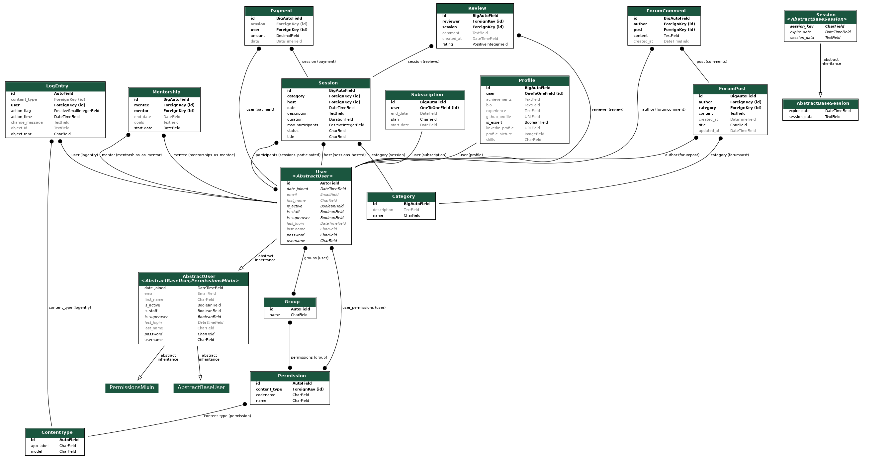
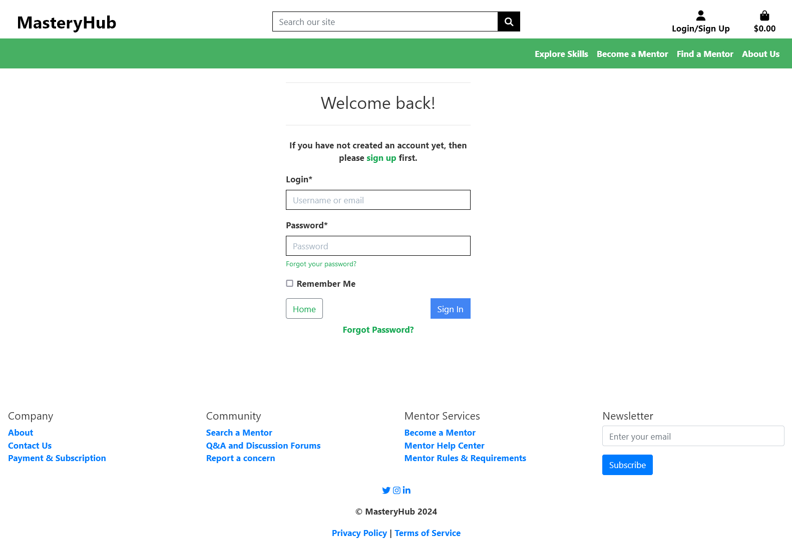
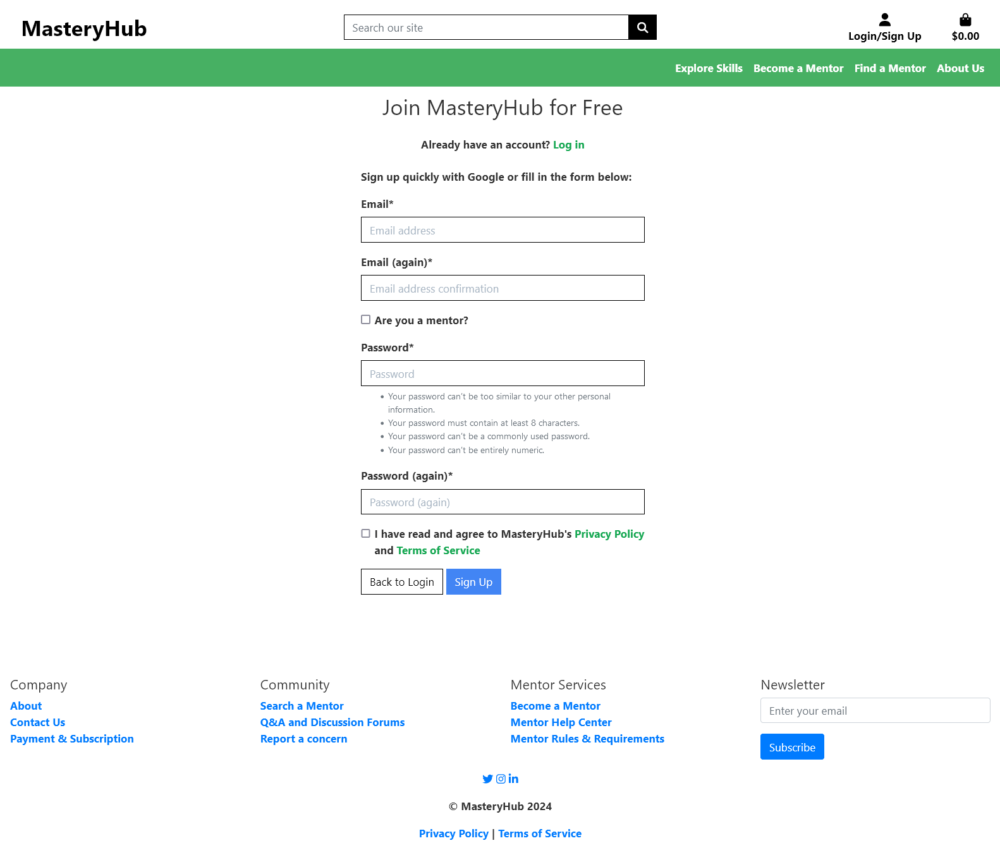
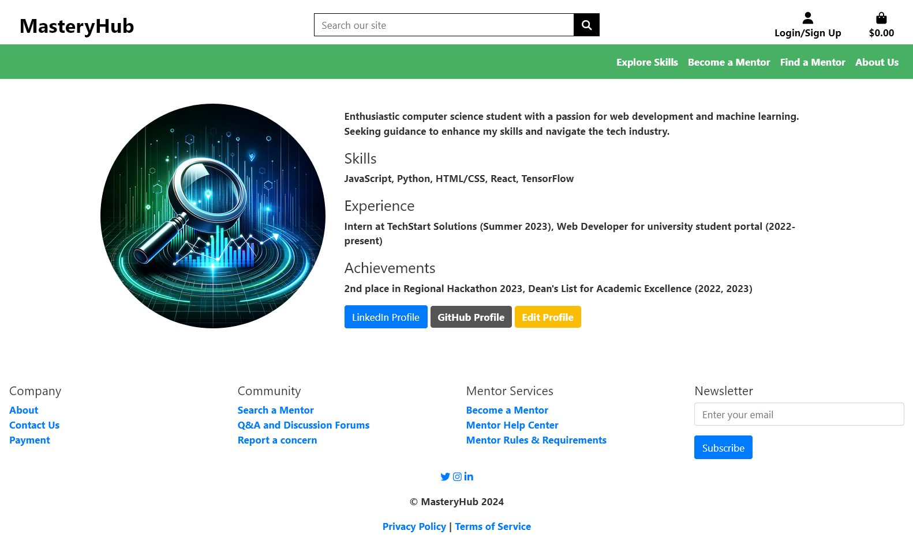
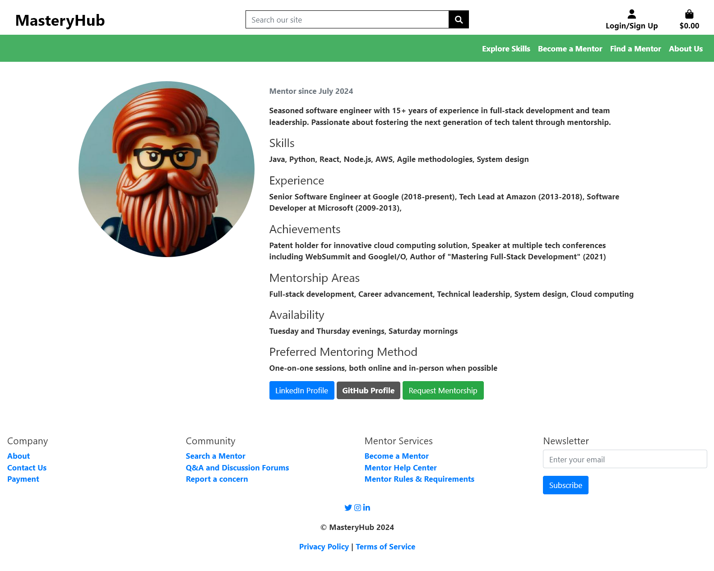
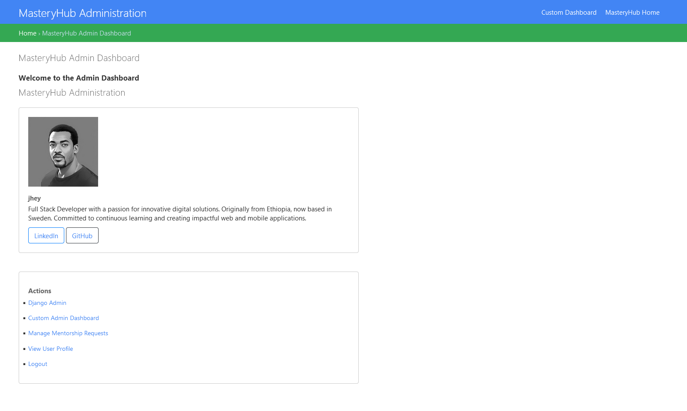
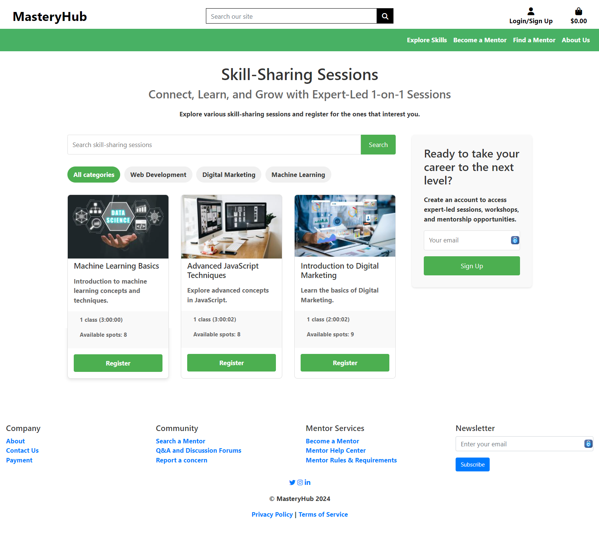

# MasteryHub: Skill-Sharing Platform for Professionals

## Table of Contents
- [Introduction](#introduction)
- [Problem Statement](#problem-statement)
- [Solution Overview](#solution-overview)
- [User Experience](#user-experience)
- [Project Goals](#project-goals)
- [Agile Methodology](#agile-methodology)
  - [User Stories](#user-stories)
  - [Project Board](#project-board)
- [Design](#design)
  - [Color Scheme](#color-scheme)
  - [Wireframes](#wireframes)
- [Data Model](#data-model)
  - [User Journey](#user-journey)
  - [Database Scheme](#database-scheme)
  - [ERD Diagram](#erd-diagram)
- [Main Technologies](#main-technologies)
- [Key Features](#key-features)
- [Security Features](#security-features)
- [Planned Features](#planned-features)
- [Current Status](#current-status)

## Introduction

In today's rapidly changing job market, professionals often need to acquire new skills or share their expertise with others to stay competitive and advance their careers. The Skill-Sharing Platform for Professionals aims to address this need by providing a web-based platform that connects professionals who want to learn new skills with experts willing to share their knowledge.

## Problem Statement

Finding the right resources, connecting with experts, and engaging in meaningful skill-sharing can be challenging for professionals looking to enhance their skill sets and career opportunities.

## Solution Overview

This platform facilitates skill-sharing sessions, workshops, and mentorship opportunities, allowing users to learn from and collaborate with experienced professionals in various domains.

## User Experience

The primary goal of this project is to provide an exceptional user experience for learners, mentors, and administrators. Users will enjoy a seamless and intuitive process for creating profiles, joining skill-sharing sessions, and managing their learning progress. The system will be designed with a clean and modern interface, ensuring ease of use and accessibility across various devices.

### Mentees
Mentees can create profiles to specify their learning goals, browse available sessions, join mentorship programs, and track their skill development progress.

### Mentors
Mentors can set up profiles showcasing their expertise, create and manage skill-sharing sessions, and provide guidance to mentees through structured mentorship programs.

### Admins
Admins have access to an administrative interface to manage user accounts, oversee platform activities, and ensure the smooth operation of the platform.

## Project Goals

1. Develop a user-friendly skill-sharing platform
2. Provide comprehensive profiles for mentees, mentors, and admins
3. Ensure data integrity and security
4. Enhance user experience
5. Optimize for performance and scalability
6. Ensure responsiveness and accessibility

## Agile Methodology

The project is being developed using an Agile methodology to help prioritize and organize tasks. This involves writing user stories and using Project Boards on GitHub.

### User Stories

A template is created to help write user stories in a consistent format: "As a [type of user], I want [goal] so that [benefit]."

#### Developer User Stories

1. Frontend Development
2. Backend Development
3. Database Integration
4. Payment Integration
5. API Development
6. User Authentication and Authorization

#### User Stories for Platform Users

1. Mentee Profile Creation
2. Mentor Profile Creation
3. Admin Profile Creation
4. Skill-Sharing Sessions
5. Mentor-Mentee Matching
6. Q&A and Discussion Forums
7. Skill Assessment and Tracking
8. Access to Premium Content

### Project Board

The project board on GitHub is publicly accessible, promoting transparency and facilitating collaboration. It employs columns such as "Backlog", "To Do", "In Progress", "Review", and "Done" to effectively track task progression. Tasks are categorized with labels like "frontend", "backend", and "user interface" to prioritize critical components of the project.

## Design

### Color Scheme

- Primary-color (#4285F4)
- Secondary-color (#34A853)
- Accent-color (#FBBC05)
- Text-color (#333333)
- Background-color (#FFFFFF)

### Wireframes

Click to view wireframes

1. [Homepage Wireframe](docs/wireframes/Homepage-Desktop.png)
2. [User Registration and Login Wireframe](docs/wireframes/Register-Desktop.png)
3. [Session Discovery Wireframe](docs/wireframes/Session-Desktop.png)
4. [Expert Dashboard Wireframe](docs/wireframes/Expert-Dashboard.png)
5. [User Profile Wireframe](docs/wireframes/User-Profile.png)
6. [Mentor-Mentee Matching Interface Wireframe](docs/wireframes/Mentor-Mentee-Matching.png)
7. [Q&A and Discussion Forums Wireframe](docs/wireframes/Discussion-Forums.png)
8. [Skill Assessment and Tracking Dashboard Wireframe](docs/wireframes/Dashboard-Desktop.png)
9. [Payment Wireframe](docs/wireframes/Payment.png)

Note: Mobile wireframes will be developed in a future iteration of the project, focusing on responsive design principles to ensure optimal user experience across all devices.

## Data Model

### User Journey

1. Registration and Profile Creation
2. Browsing and Discovering Sessions
3. Participating in Sessions
4. Providing Feedback and Reviews
5. Mentorship and Collaboration

### Database Scheme

#### Models

- User Model
- Profile Model
- Session Model
- Mentorship Model
- Forum Model
- Payment Model

### ERD Diagram

## Main Technologies

- Frontend: HTML, CSS, JavaScript
- Backend: Python, Django
- Database: Postgres
- Payments: Stripe

## Key Features

1. User Profiles for Mentees, Mentors, and Admins
2. Skill-Sharing Sessions
3. Mentor-Mentee Matching
4. Q&A and Discussion Forums
5. Skill Assessment and Tracking
6. Payment Integration
7. **Session Registration and Management**

## Security Features

- Data Encryption
- Input Validation
- Access Control
- Secure Communication
- Authentication
- Session Management

## Planned Features

1. SEO and Marketing
2. Mobile Responsiveness

## Current Status

- Home Page: Completed
- User Login and Authentication: Completed
- User Sign Up and Authentication: Completed
- **Sessions and User Registration: Completed**

### Home Page Preview

### User Login and Authentication Preview

### User Sign Up and Authentication Preview

### Mentee Profile Preview

### Mentor Profile Preview

### Admin Profile Preview

### Session Registration Preview
