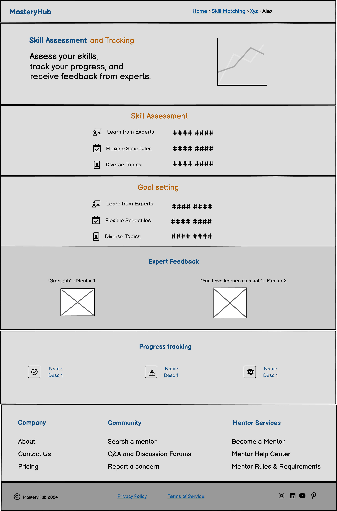

# Skill-Sharing Platform for Professionals - MasteryHub

## Table of Contents

  * [Introduction](#introduction-1)
  * [Problem Statement](#problem-statement-1)
  * [Solution Overview](#solution-overview-1)
  * [Introduction](#introduction-1)
  * [Problem Statement](#problem-statement-1)
  * [Project Goals](#project-goals)
  * [Agile Methodology](#agile-methodology)
    + [User Stories](#user-stories)
      - [Developer User Stories](#developer-user-stories)
      - [User Stories for Platform Users](#user-stories-for-platform-users)
    + [Project Board](#project-board)
  * [Design](#design)
    + [Color Scheme](#color-scheme)
    + [Wireframes](#wireframes)  
  * [Solution Overview](#solution-overview-1)
  * [User Experience](#user-experience-1)
  * [Data Model](#data-model)
    + [User Journey](#user-journey)
    + [Database Scheme](#database-scheme)
    + [Models](#models)
      - [User Model](#user-model)
      - [Profile Model](#profile-model)
      - [Session Model](#session-model)
      - [Mentorship Model](#mentorship-model)
      - [ForumPost Model](#forumpost-model)
      - [Payment Model](#payment-model)
    + [ERD Diagram](#erd-diagram)
  * [Main Technologies](#main-technologies)
  * [Key Features](#key-features)
  * [Planned Features](#planned-features)
  * [Security Features](#security-features)

<small><i><a href='http://ecotrust-canada.github.io/markdown-toc/'>Table of contents generated with markdown-toc</a></i></small>

## Introduction

In today's rapidly changing job market, professionals often need to acquire new skills or share their expertise with others to stay competitive and advance their careers. The Skill-Sharing Platform for Professionals aims to address this need by providing a web-based platform that connects professionals who want to learn new skills with experts willing to share their knowledge.

## Problem Statement

Finding the right resources, connecting with experts, and engaging in meaningful skill-sharing can be challenging for professionals looking to enhance their skill sets and career opportunities.

## Solution Overview

This platform facilitates skill-sharing sessions, workshops, and mentorship opportunities, allowing users to learn from and collaborate with experienced professionals in various domains.

## User Experience

The primary goal of this project is to provide an exceptional user experience for both learners and experts. Users will enjoy a seamless and intuitive process for creating profiles, joining skill-sharing sessions, and managing their learning progress. The system will be designed with a clean and modern interface, ensuring ease of use and accessibility across various devices.

Experts will benefit from a comprehensive administrative interface that streamlines the management of their sessions, participants, and feedback. The interface will be user-friendly and efficient, allowing experts to quickly access and update relevant data, ensuring smooth operations and excellent service.

## Project Goals

1. **Develop a user-friendly skill-sharing platform**: Implement a web-based application that allows users to easily create profiles, join sessions, and manage their learning progress.
2. **Provide an administrative interface**: Create a secure and comprehensive administrative interface for experts to manage sessions, participants, and feedback.
3. **Ensure data integrity and security**: Implement robust data validation and security measures to protect user information and ensure the integrity of the platform.
4. **Enhance user experience**: Incorporate features that enhance the user experience, such as email confirmations, reminders, and the ability to leave reviews or feedback.
5. **Optimize for performance and scalability**: Develop the system with performance and scalability in mind, ensuring it can handle high traffic and grow with user needs.
6. **Ensure responsiveness and accessibility**: Design the user interface to be responsive and accessible across various devices and platforms, ensuring a consistent and inclusive experience for all users.

## Agile Methodology

The project is being developed using an Agile methodology to help prioritize and organize tasks. This involves writing user stories and using Project Boards on GitHub.

### User Stories

A template is created to help write user stories in a consistent format: "As a [type of user], I want [goal] so that [benefit]."

#### Developer User Stories

1. **Frontend Development**
   - As a developer, I want to set up the frontend using HTML, CSS, and JavaScript so that I can create an interactive and user-friendly interface for the platform.

2. **Backend Development**
   - As a developer, I want to implement the backend using Python and Django so that I can handle the business logic and data management securely and efficiently.

3. **Database Integration**
   - As a developer, I want to integrate Postgres for the database so that I can store and manage user data, session data, and other relevant information.

4. **Payment Integration**
   - As a developer, I want to set up Stripe for payments so that users can easily and securely pay for premium content and sessions.

5. **API Development**
   - As a developer, I want to build a robust API so that the frontend and backend can communicate seamlessly.

6. **User Authentication and Authorization**
   - As a developer, I want to create user authentication and authorization features so that user data and sessions are secure.

#### User Stories for Platform Users

1. **Profile Creation**
   - As a user, I want to create a profile highlighting my skills, experience, and areas of expertise so that I can showcase my qualifications to potential collaborators and mentors.

2. **Skill-Sharing Sessions**
   - As a user, I want to browse and register for skill-sharing sessions, workshops, and webinars so that I can learn and improve my skills.

3. **Mentor-Mentee Matching**
   - As a user, I want to be matched with potential mentors based on my skills and goals so that I can receive personalized guidance and support.

4. **Q&A and Discussion Forums**
   - As a user, I want to participate in Q&A and discussion forums so that I can seek advice, ask questions, and engage with the community.

5. **Skill Assessment and Tracking**
   - As a user, I want to assess and track my skill development and progress so that I can measure my growth and achievements over time.

6. **Access to Premium Content**
   - As a user, I want to access premium content and one-on-one mentorship sessions so that I can gain deeper insights and more personalized learning opportunities.

### Project Board

The project board on GitHub is publicly accessible, promoting transparency and facilitating collaboration. It employs columns such as "Backlog", "To Do", "In Progress", "Review", and "Done" to effectively track task progression.

Tasks are categorized with labels like "frontend", "backend", and "user interface" to prioritize critical components of the project. This systematic approach ensures that the most important tasks are addressed promptly and efficiently.

## Design

### Color Scheme

The color scheme for the Skill-Sharing Platform aims to create a professional and engaging atmosphere conducive to learning and collaboration. The primary colors are chosen to inspire creativity and focus.

- **Primary-color (#4285F4)**: A vibrant blue shade used for primary elements like buttons and headings to convey trust and professionalism.
- **Secondary-color (#34A853)**: A fresh green shade used for secondary elements like navigation and accents, symbolizing growth and learning.
- **Accent-color (#FBBC05)**: A bright yellow shade used for highlighting important elements and adding energy to the interface.
- **Text-color (#333333)**: A dark gray shade used for body text to ensure readability and contrast with the background.
- **Background-color (#FFFFFF)**: A clean white background to maintain a modern and minimalist look.

### Wireframes

Below are wireframe examples for different sections of the Skill-Sharing Platform:

1. **Homepage Wireframe:**
   - The homepage features a welcoming introduction, platform navigation, and highlights of upcoming skill-sharing sessions.
   - It maintains a clean and inviting layout to encourage exploration and engagement.

   

2. **User Registration and Login Wireframe:**
   - The registration form includes fields for user credentials, skills, and areas of interest.
   - The login form provides easy access to user accounts with options for social login and password recovery.

   

3. **Session Discovery Wireframe:**
   - The session discovery interface allows users to search and filter skill-sharing sessions based on topics, dates, and ratings.
   - It showcases session details and provides options for registration and participation.

   

4. **Expert Dashboard Wireframe:**
   - The expert dashboard empowers mentors to manage their sessions, view participant details, and receive feedback.
   - It offers insights into session performance and tools for improving engagement and content delivery.

   

5. **User Profile Wireframe:**
   - The user profile page showcases skills, experience, and areas of expertise.
   - It includes sections for projects, certifications, and achievements.

   

6. **Mentor-Mentee Matching Interface Wireframe:**
   - The mentor-mentee matching system includes a questionnaire for skills and goals, a matching results page, and a communication interface.

   

7. **Q&A and Discussion Forums Wireframe:**
   - The Q&A and discussion forums feature a main forum page with categories, a thread view, and a post creation interface.

   

8. **Skill Assessment and Tracking Dashboard Wireframe:**
   - The skill assessment and tracking dashboard includes features for skill evaluation, progress tracking, goal setting, and expert feedback.

   

9. **Payment Wireframe:**
   - The payment system includes page for a checkout process, and account management for subscriptions.

   

Note: Mobile wireframes will be developed in a future iteration of the project, focusing on responsive design principles to ensure optimal user experience across all devices.

## Data Model

### User Journey

The user journey for the Skill-Sharing Platform includes the following key steps:

1. **Registration**: New users create an account by providing their details and areas of expertise or interest.
2. **Login**: Registered users log in to access the platform's features.
3. **Profile Creation**: Users create and customize their profiles, highlighting skills and experiences.
4. **Session Browsing**: Users can search and browse available skill-sharing sessions.
5. **Session Booking**: Users can register for sessions that interest them.
6. **Mentorship Matching**: Users can be matched with mentors based on their skills and goals.
7. **Forum Participation**: Users can engage in Q&A and discussion forums.
8. **Skill Assessment**: Users can assess their skills and track their progress over time.
9. **Review and Feedback**: After sessions, users can leave reviews and provide feedback.

### Database Scheme

The database scheme will include tables for users, profiles, sessions, mentorships, forum posts, and payments:

- **Users**: Stores user authentication information.
- **Profiles**: Stores detailed user information, skills, and experiences.
- **Sessions**: Stores information about skill-sharing sessions, including host, participants, and details.
- **Mentorships**: Stores mentorship relationships between users.
- **ForumPosts**: Stores user posts and comments in discussion forums.
- **Payments**: Stores payment information for premium content and sessions.

### Models

#### User Model

- **Fields**: id, username, email, password
- **Relationships**: One-to-One relationship with Profile, One-to-Many relationships with Session, Mentorship, ForumPost, and Payment

#### Profile Model

- **Fields**: id, user, bio, skills, experience, achievements, profile_picture, linkedin_profile, github_profile, is_expert
- **Relationships**: One-to-One relationship with User

#### Session Model

- **Fields**: id, title, description, date, duration, host, category, status, max_participants
- **Relationships**: Many-to-One relationship with User (host), Many-to-Many relationship with User (participants)

#### Mentorship Model

- **Fields**: id, mentor, mentee, start_date, end_date, goals
- **Relationships**: Many-to-One relationships with User (mentor and mentee)

#### Forum Model

- **Fields**: id, title, content, author, category, created_at, updated_at, parent_post
- **Relationships**: Many-to-One relationship with User (author)

#### Payment Model

- **Fields**: id, user, amount, date, session
- **Relationships**: Many-to-One relationships with User and Session

### ERD Diagram

An ERD diagram will visually represent the relationships between the different tables in the database.

## Security Features
The Skill-Sharing Platform will include the following security features:
- **Data Encryption**: All sensitive data, such as passwords and payment information, will be encrypted using strong encryption algorithms.
- **Input Validation**: All user inputs will be validated to prevent SQL injection and other common attacks.
- **Access Control**: User roles (e.g., regular user, expert, admin) and permissions will be implemented to ensure that only authorized users can access certain features and data.
- **Secure Communication**: All communication between the client and server will be encrypted using HTTPS.
- **Authentication**: Robust user authentication system will be implemented, potentially including options for two-factor authentication.
- **Session Management**: Secure session handling to prevent session hijacking and ensure user privacy.

## Main Technologies

- **Frontend**: HTML, CSS, JavaScript
- **Backend**: Python, Django
- **Database**: Postgres
- **Payments**: Stripe

## Key Features

## Planned Features

- **User Profiles**: Allow users to create profiles highlighting their skills, experience, and areas of expertise. Include features for users to showcase their projects, certifications, and achievements.
- **Skill-Sharing Sessions**: Implement a system for experts to create and host skill-sharing sessions, workshops, or webinars. Users can browse, register, and participate in these sessions based on their interests and learning goals.
- **Mentor-Mentee Matching**: Develop an algorithm to match mentees with potential mentors based on their skills, experience, and goals. Facilitate communication and collaboration between mentors and mentees through the platform.
- **Q&A and Discussion Forums**: Create forums where users can ask questions, seek advice, and engage in discussions related to specific skills or industries. Encourage knowledge sharing and community building.
- **Skill Assessment and Tracking**: Implement features for users to assess their skills, track their progress, and receive feedback from experts. Provide tools for setting learning goals and measuring achievements.
- **Payment**: Integrate a payment system for users to purchase access to premium content, courses, or one-on-one mentorship sessions. 
- **SEO and Marketing**: Implement SEO best practices to improve the platform's visibility in search engine results. Develop marketing strategies to attract professionals and experts to the platform, such as content marketing, social media campaigns, and email marketing.
- **Mobile Responsiveness**: Ensure the platform is fully responsive and provides an optimal experience on mobile devices.

## Current Status
- **Home Page**: The home page of the app is completed.
- **User Login and Authentication**: User login and authentication features are completed.

### Home Page Preview

### User Login and Authentication Preview

## Introduction

In today's rapidly changing job market, professionals often need to acquire new skills or share their expertise with others to stay competitive and advance their careers. The Skill-Sharing Platform for Professionals aims to address this need by providing a web-based platform that connects professionals who want to learn new skills with experts willing to share their knowledge.

## Problem Statement

Finding the right resources, connecting with experts, and engaging in meaningful skill-sharing can be challenging for professionals looking to enhance their skill sets and career opportunities.

## Solution Overview

This platform facilitates skill-sharing sessions, workshops, and mentorship opportunities, allowing users to learn from and collaborate with experienced professionals in various domains.

## User Experience

The primary goal of this project is to provide an exceptional user experience for both learners and experts. Users will enjoy a seamless and intuitive process for creating profiles, joining skill-sharing sessions, and managing their learning progress. The system will be designed with a clean and modern interface, ensuring ease of use and accessibility across various devices.

Experts will benefit from a comprehensive administrative interface that streamlines the management of their sessions, participants, and feedback. The interface will be user-friendly and efficient, allowing experts to quickly access and update relevant data, ensuring smooth operations and excellent service.

## Project Goals

1. **Develop a user-friendly skill-sharing platform**: Implement a web-based application that allows users to easily create profiles, join sessions, and manage their learning progress.
2. **Provide an administrative interface**: Create a secure and comprehensive administrative interface for experts to manage sessions, participants, and feedback.
3. **Ensure data integrity and security**: Implement robust data validation and security measures to protect user information and ensure the integrity of the platform.
4. **Enhance user experience**: Incorporate features that enhance the user experience, such as email confirmations, reminders, and the ability to leave reviews or feedback.
5. **Optimize for performance and scalability**: Develop the system with performance and scalability in mind, ensuring it can handle high traffic and grow with user needs.
6. **Ensure responsiveness and accessibility**: Design the user interface to be responsive and accessible across various devices and platforms, ensuring a consistent and inclusive experience for all users.

## Agile Methodology

The project is being developed using an Agile methodology to help prioritize and organize tasks. This involves writing user stories and using Project Boards on GitHub.

### User Stories

A template is created to help write user stories in a consistent format: "As a [type of user], I want [goal] so that [benefit]."

#### Developer User Stories

1. **Frontend Development**
   - As a developer, I want to set up the frontend using HTML, CSS, and JavaScript so that I can create an interactive and user-friendly interface for the platform.

2. **Backend Development**
   - As a developer, I want to implement the backend using Python and Django so that I can handle the business logic and data management securely and efficiently.

3. **Database Integration**
   - As a developer, I want to integrate Postgres for the database so that I can store and manage user data, session data, and other relevant information.

4. **Payment Integration**
   - As a developer, I want to set up Stripe for payments so that users can easily and securely pay for premium content and sessions.

5. **API Development**
   - As a developer, I want to build a robust API so that the frontend and backend can communicate seamlessly.

6. **User Authentication and Authorization**
   - As a developer, I want to create user authentication and authorization features so that user data and sessions are secure.

#### User Stories for Platform Users

1. **Profile Creation**
   - As a user, I want to create a profile highlighting my skills, experience, and areas of expertise so that I can showcase my qualifications to potential collaborators and mentors.

2. **Skill-Sharing Sessions**
   - As a user, I want to browse and register for skill-sharing sessions, workshops, and webinars so that I can learn and improve my skills.

3. **Mentor-Mentee Matching**
   - As a user, I want to be matched with potential mentors based on my skills and goals so that I can receive personalized guidance and support.

4. **Q&A and Discussion Forums**
   - As a user, I want to participate in Q&A and discussion forums so that I can seek advice, ask questions, and engage with the community.

5. **Skill Assessment and Tracking**
   - As a user, I want to assess and track my skill development and progress so that I can measure my growth and achievements over time.

6. **Access to Premium Content**
   - As a user, I want to access premium content and one-on-one mentorship sessions so that I can gain deeper insights and more personalized learning opportunities.

### Project Board

The project board on GitHub is publicly accessible, promoting transparency and facilitating collaboration. It employs columns such as "Backlog", "To Do", "In Progress", "Review", and "Done" to effectively track task progression.

Tasks are categorized with labels like "frontend", "backend", and "user interface" to prioritize critical components of the project. This systematic approach ensures that the most important tasks are addressed promptly and efficiently.

## Design

### Color Scheme

The color scheme for the Skill-Sharing Platform aims to create a professional and engaging atmosphere conducive to learning and collaboration. The primary colors are chosen to inspire creativity and focus.

- **Primary-color (#4285F4)**: A vibrant blue shade used for primary elements like buttons and headings to convey trust and professionalism.
- **Secondary-color (#34A853)**: A fresh green shade used for secondary elements like navigation and accents, symbolizing growth and learning.
- **Accent-color (#FBBC05)**: A bright yellow shade used for highlighting important elements and adding energy to the interface.
- **Text-color (#333333)**: A dark gray shade used for body text to ensure readability and contrast with the background.
- **Background-color (#FFFFFF)**: A clean white background to maintain a modern and minimalist look.

### Wireframes

Below are wireframe examples for different sections of the Skill-Sharing Platform:

1. **Homepage Wireframe:**
   - The homepage features a welcoming introduction, platform navigation, and highlights of upcoming skill-sharing sessions.
   - It maintains a clean and inviting layout to encourage exploration and engagement.

   

2. **User Registration and Login Wireframe:**
   - The registration form includes fields for user credentials, skills, and areas of interest.
   - The login form provides easy access to user accounts with options for social login and password recovery.

   

3. **Session Discovery Wireframe:**
   - The session discovery interface allows users to search and filter skill-sharing sessions based on topics, dates, and ratings.
   - It showcases session details and provides options for registration and participation.

   

4. **Expert Dashboard Wireframe:**
   - The expert dashboard empowers mentors to manage their sessions, view participant details, and receive feedback.
   - It offers insights into session performance and tools for improving engagement and content delivery.

   

5. **User Profile Wireframe:**
   - The user profile page showcases skills, experience, and areas of expertise.
   - It includes sections for projects, certifications, and achievements.

   

6. **Mentor-Mentee Matching Interface Wireframe:**
   - The mentor-mentee matching system includes a questionnaire for skills and goals, a matching results page, and a communication interface.

   

7. **Q&A and Discussion Forums Wireframe:**
   - The Q&A and discussion forums feature a main forum page with categories, a thread view, and a post creation interface.

   

8. **Skill Assessment and Tracking Dashboard Wireframe:**
   - The skill assessment and tracking dashboard includes features for skill evaluation, progress tracking, goal setting, and expert feedback.

   

9. **Payment Wireframe:**
   - The payment system includes page for a checkout process, and account management for subscriptions.

   

Note: Mobile wireframes will be developed in a future iteration of the project, focusing on responsive design principles to ensure optimal user experience across all devices.

## Data Model

### User Journey

The user journey for the Skill-Sharing Platform includes the following key steps:

1. **Registration**: New users create an account by providing their details and areas of expertise or interest.
2. **Login**: Registered users log in to access the platform's features.
3. **Profile Creation**: Users create and customize their profiles, highlighting skills and experiences.
4. **Session Browsing**: Users can search and browse available skill-sharing sessions.
5. **Session Booking**: Users can register for sessions that interest them.
6. **Mentorship Matching**: Users can be matched with mentors based on their skills and goals.
7. **Forum Participation**: Users can engage in Q&A and discussion forums.
8. **Skill Assessment**: Users can assess their skills and track their progress over time.
9. **Review and Feedback**: After sessions, users can leave reviews and provide feedback.

### Database Scheme

The database scheme will include tables for users, profiles, sessions, mentorships, forum posts, and payments:

- **Users**: Stores user authentication information.
- **Profiles**: Stores detailed user information, skills, and experiences.
- **Sessions**: Stores information about skill-sharing sessions, including host, participants, and details.
- **Mentorships**: Stores mentorship relationships between users.
- **ForumPosts**: Stores user posts and comments in discussion forums.
- **Payments**: Stores payment information for premium content and sessions.

### Models

#### User Model

- **Fields**: id, username, email, password
- **Relationships**: One-to-One relationship with Profile, One-to-Many relationships with Session, Mentorship, ForumPost, and Payment

#### Profile Model

- **Fields**: id, user, bio, skills, experience, achievements, profile_picture, linkedin_profile, github_profile, is_expert
- **Relationships**: One-to-One relationship with User

#### Session Model

- **Fields**: id, title, description, date, duration, host, category, status, max_participants
- **Relationships**: Many-to-One relationship with User (host), Many-to-Many relationship with User (participants)

#### Mentorship Model

- **Fields**: id, mentor, mentee, start_date, end_date, goals
- **Relationships**: Many-to-One relationships with User (mentor and mentee)

#### Forum Model

- **Fields**: id, title, content, author, category, created_at, updated_at, parent_post
- **Relationships**: Many-to-One relationship with User (author)

#### Payment Model

- **Fields**: id, user, amount, date, session
- **Relationships**: Many-to-One relationships with User and Session

### ERD Diagram

An ERD diagram will visually represent the relationships between the different tables in the database.

## Security Features
The Skill-Sharing Platform will include the following security features:
- **Data Encryption**: All sensitive data, such as passwords and payment information, will be encrypted using strong encryption algorithms.
- **Input Validation**: All user inputs will be validated to prevent SQL injection and other common attacks.
- **Access Control**: User roles (e.g., regular user, expert, admin) and permissions will be implemented to ensure that only authorized users can access certain features and data.
- **Secure Communication**: All communication between the client and server will be encrypted using HTTPS.
- **Authentication**: Robust user authentication system will be implemented, potentially including options for two-factor authentication.
- **Session Management**: Secure session handling to prevent session hijacking and ensure user privacy.

## Main Technologies

- **Frontend**: HTML, CSS, JavaScript
- **Backend**: Python, Django
- **Database**: Postgres
- **Payments**: Stripe

## Key Features

## Planned Features

- **User Profiles**: Allow users to create profiles highlighting their skills, experience, and areas of expertise. Include features for users to showcase their projects, certifications, and achievements.
- **Skill-Sharing Sessions**: Implement a system for experts to create and host skill-sharing sessions, workshops, or webinars. Users can browse, register, and participate in these sessions based on their interests and learning goals.
- **Mentor-Mentee Matching**: Develop an algorithm to match mentees with potential mentors based on their skills, experience, and goals. Facilitate communication and collaboration between mentors and mentees through the platform.
- **Q&A and Discussion Forums**: Create forums where users can ask questions, seek advice, and engage in discussions related to specific skills or industries. Encourage knowledge sharing and community building.
- **Skill Assessment and Tracking**: Implement features for users to assess their skills, track their progress, and receive feedback from experts. Provide tools for setting learning goals and measuring achievements.
- **Payment**: Integrate a payment system for users to purchase access to premium content, courses, or one-on-one mentorship sessions. 
- **SEO and Marketing**: Implement SEO best practices to improve the platform's visibility in search engine results. Develop marketing strategies to attract professionals and experts to the platform, such as content marketing, social media campaigns, and email marketing.
- **Mobile Responsiveness**: Ensure the platform is fully responsive and provides an optimal experience on mobile devices.

## Current Status
- **Home Page**: The home page of the app is completed.
- **User Login and Authentication**: User login and authentication features are completed.

### Home Page Preview

### User Login and Authentication Preview

