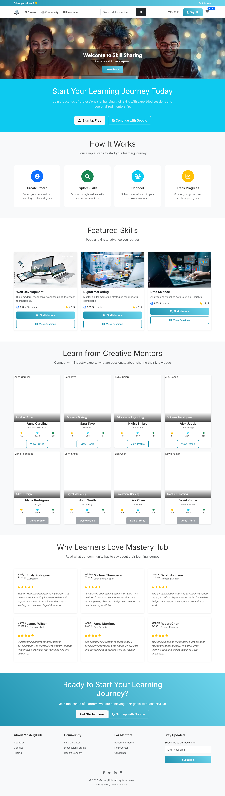
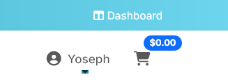
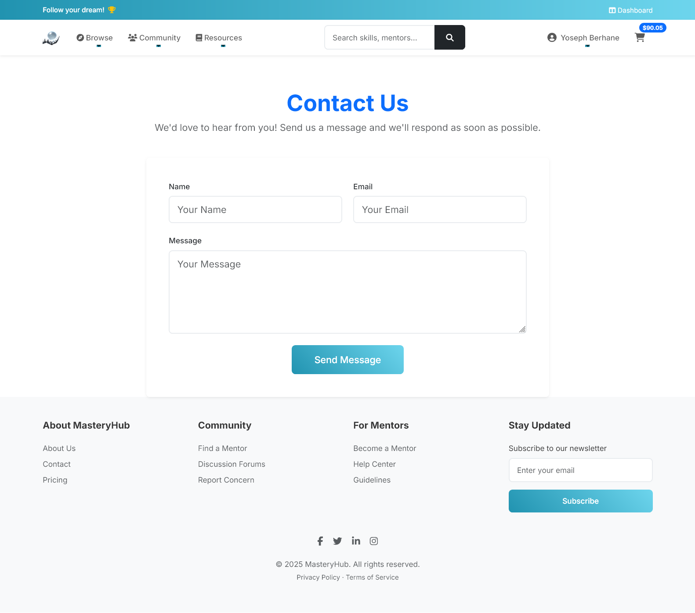
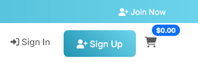
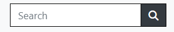
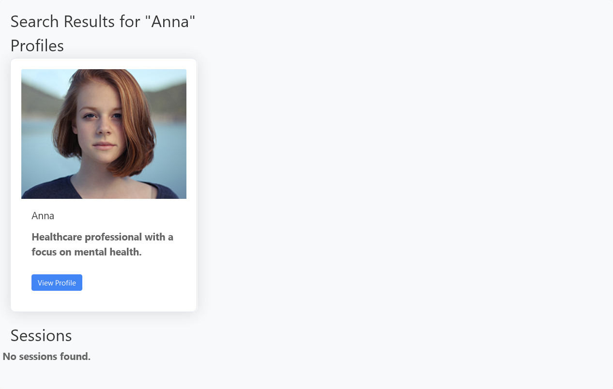
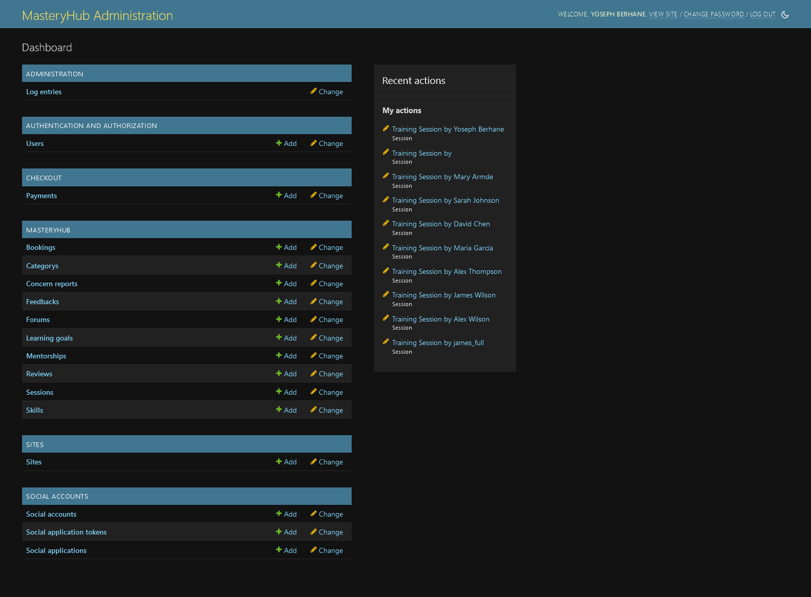
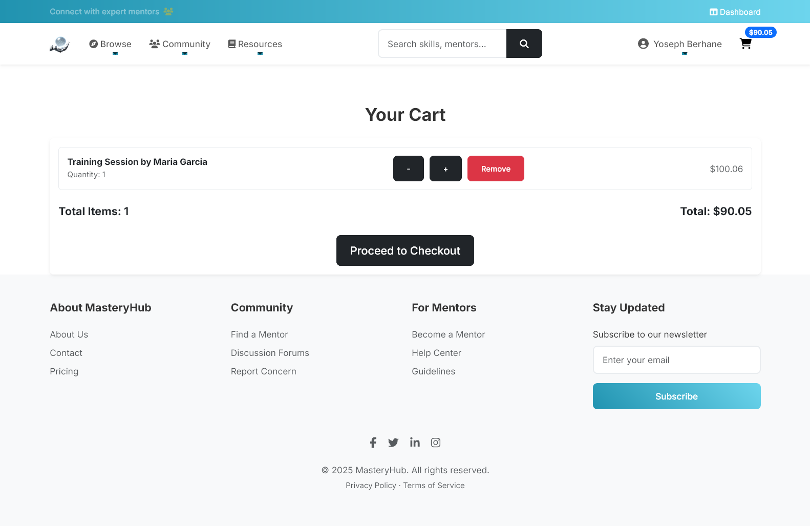
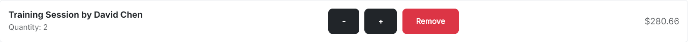
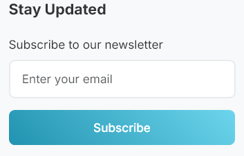

# MasteryHub: Skill-Sharing Platform for Professionals


Welcome to MasteryHub, your go-to platform for mentorship and skill development. This application connects mentees with experienced mentors across various fields, offering personalized guidance and support.

Some features on the site are available exclusively to registered users, including accessing the dashboard, booking mentorship sessions, and tracking progress.

Users can search for mentors, view mentor profiles, request mentorship, and schedule sessions. There is also a resources section, privacy policy, and a section for providing feedback.

[Live link to MasteryHub](https://skill-sharing-446c0336ffb5.herokuapp.com/)

<br>

## Table of Contents

- [MasteryHub: Skill-Sharing Platform for Professionals](#masteryhub--skill-sharing-platform-for-professionals)
  * [Table of Contents](#table-of-contents)
- [UX](#ux)
  * [The Strategy Plane](#the-strategy-plane)
    + [Targeted Users](#targeted-users)
    + [Site Goals](#site-goals)
    + [Project Goals](#project-goals)
  * [**Agile Planning**](#--agile-planning--)
  * [User Stories](#user-stories)
  * [Fundamental Structure](#fundamental-structure)
    + [Wireframes](#wireframes)
    + [Database Scheme](#database-scheme)
    + [ERD Diagram](#erd-diagram)
  * [Main plan](#main-plan)
  * [Structure Plane](#structure-plane)
- [Features](#features)
  * [Existing Features](#existing-features)
    + [Home Page Preview](#home-page-preview)
    + [Skill-Sharing Sessions Section](#skill-sharing-sessions-section)
    + [Features:](#features-)
    + [Dropdown Options:](#dropdown-options-)
    + [Editing Options:](#editing-options-)
    + [Unauthorized Users:](#unauthorized-users-)
    + [Footer](#footer)
    + [Contact Page](#contact-page)
    + [Main Nav Menu](#main-nav-menu)
    + [Restricted Pages](#restricted-pages)
    + [Search Bar](#search-bar)
    + [Session Details Page](#session-details-page)
  * [My Account Dropdown](#my-account-dropdown)
  * [User Sign Up Page](#user-sign-up-page)
  * [User Sign In Page](#user-sign-in-page)
  * [User Sign Out Page](#user-sign-out-page)
  * [User Profile Page](#user-profile-page)
  * [Dropdown Menu Content](#dropdown-menu-content)
  * [Basket Page](#basket-page)
  * [Checkout Page](#checkout-page)
  * [Models](#models)
    + [Error Page](#error-page)
  * [Future Features](#future-features)
  * [Design](#design)
    + [Color Scheme](#color-scheme)
    + [Typography](#typography)
    + [Images](#images)
  * [**Business Model**](#--business-model--)
  * [**Marketing Strategy**](#--marketing-strategy--)
    + [**Social Media Marketing**](#--social-media-marketing--)
    + [**Newsletter Marketing**](#--newsletter-marketing--)
  * [**Search Engine Optimization (SEO)**](#--search-engine-optimization--seo---)
    + [**Keywords**](#--keywords--)
- [Keyword Research Process](#keyword-research-process)
  * [Brainstorm General Topics](#brainstorm-general-topics)
  * [Brain Dump Potential Keywords](#brain-dump-potential-keywords)
  * [Research Keywords in Google](#research-keywords-in-google)
  * [Ensure Mix of Head Terms and Long-Tail](#ensure-mix-of-head-terms-and-long-tail)
  * [Assess Keyword Relevance and Search Volume](#assess-keyword-relevance-and-search-volume)
  * [Final List of Keywords](#final-list-of-keywords)
    + [**Sitemap.xml**](#--sitemapxml--)
    + [**Robots.txt**](#--robotstxt--)
  * [Main Technologies](#main-technologies)
  * [Frameworks Used](#frameworks-used)
  * [Libraries And Installed Packages](#libraries-and-installed-packages)
  * [Tools And Resources](#tools-and-resources)
- [Testing](#testing)
- [Bugs](#bugs)
- [Credits](#credits)
  * [Below is a list of sources of information that helped me and inspired me with their ideas:](#below-is-a-list-of-sources-of-information-that-helped-me-and-inspired-me-with-their-ideas-)
    + [Deployment](#deployment)
    + [ElephantSQL Database](#elephantsql-database)
    + [Amazon AWS](#amazon-aws)
      - [S3 Bucket](#s3-bucket)
      - [IAM](#iam)
      - [Final AWS Setup](#final-aws-setup)
    + [Stripe API](#stripe-api)
    + [Gmail API](#gmail-api)
    + [Heroku Deployment](#heroku-deployment)
    + [Local Deployment](#local-deployment)
      - [Cloning](#cloning)
      - [Forking](#forking)
- [Acknowledgements](#acknowledgements)

<small><i><a href='http://ecotrust-canada.github.io/markdown-toc/'>Table of contents generated with markdown-toc</a></i></small>

<br>

# UX

## The Strategy Plane

### Targeted Users

- Professionals seeking to acquire new skills.
- Experts looking to share their knowledge and mentor others.
- Individuals interested in continuous learning and career advancement.

### Site Goals

- Enabling users to easily find and join skill-sharing sessions.
- Facilitating seamless mentor-mentee matching.
- Providing users with the ability to create and manage their learning profiles.
- Allowing users to track their skill development progress.
- Offering users the ability to provide and receive feedback on sessions.

### Project Goals

- Develop a functional skill-sharing platform.
- Incorporate comprehensive features for an engaging and educational experience.
- Apply knowledge gained from previous projects to make this platform more advanced.
- Introduce new elements, such as mentorship programs and Q&A forums, to enhance interactivity.
- Ensure a user-friendly interface for easy navigation and a seamless learning experience.

<br>

[Back to Top](#table-of-contents)

<br>

## **Agile Planning**

My project followed an agile planning approach, based on user stories. Each user story was meticulously planned and included in a specific iteration.

To prioritize development efforts, features were categorized as Must Have, Should Have, Could Have, and Won't Have. This classification helped determine the importance of each feature.

The skill-sharing section took precedence as the primary focus of the platform, receiving the most attention and time for completion.

The Project board [here](https://github.com/users/yosephdev/projects/7).


[Back to Top](#table-of-contents)

<br>

## User Stories

* Based on the collected and studied user stories, a project implementation plan was developed.
You can read user stories [here](https://github.com/MasteryHub/issues?q=is%3Aissue+is%3Aclosed).


<br>

[Back to Top](#table-of-contents)

<br>

## Fundamental Structure

### Wireframes

- To facilitate the design of the website, I created wireframes for every page. Adhering to best practices, wireframes were crafted for mobile and desktop dimensions. [Balsamiq](https://balsamiq.com/) was employed as the tool for creating the site's wireframes.

<details>
<summary>Click to view wireframes</summary>

1. [Homepage Wireframe](docs/wireframes/Homepage-Desktop.png)
2. [User Registration and Login Wireframe](docs/wireframes/Register-Desktop.png)
3. [Session Discovery Wireframe](docs/wireframes/Session-Desktop.png)
4. [Expert Dashboard Wireframe](docs/wireframes/Expert-Dashboard.png)
5. [User Profile Wireframe](docs/wireframes/User-Profile.png)
6. [Mentor-Mentee Matching Interface Wireframe](docs/wireframes/Mentor-Mentee-Matching.png)
7. [Q&A and Discussion Forums Wireframe](docs/wireframes/Discussion-Forums.png)
8. [Skill Assessment and Tracking Dashboard Wireframe](docs/wireframes/Dashboard-Desktop.png)
9. [Payment Wireframe](docs/wireframes/Payment.png)

</details>

Note: Mobile wireframes will be developed in a future iteration of the project, focusing on responsive design principles to ensure optimal user experience across all devices.

### Database Scheme

### ERD Diagram

- I created an entity relationship diagram (ERD) for my Django project using Graphviz and Django Extensions. This visual guide has streamlined my development process by clearly representing the connections between data structures.


<br>

## Main plan
- Designing a captivating homepage with striking hero images that clearly convey the website's purpose to visitors.

- Implementing user account registration for secure access to content editing, profile management, and efficient checkout with saved user information.

- Developing a fully responsive website to ensure smooth functionality across all devices and optimized navigation for mobile users.

- Equipping superusers with the ability to create, view, update, and delete reviews for both users and products.

<br>

[Back to Top](#table-of-contents)

<br>

## Structure Plane

# Features 

## Existing Features

### Home Page Preview

The Home page of this online resource is an attractive and informative landing page, designed to capture users' attention.
<br>

[Back to Top](#table-of-contents)

<br>

### Skill-Sharing Sessions Section


The Skill-Sharing Sessions page allows users to explore and register for various sessions. 

### Features:
- **Session Listings**: Displays sessions with images, titles, descriptions, and other details.
- **Search & Filter**: Search sessions or filter by category.
- **Session Actions**:
  - **View Details**: Link to view detailed information about each session.
  - **Add to Bag**: Button to add sessions to the shopping bag.
- **User Interaction**:
  - **Unauthorized Users**: Prompted to log in or register.

### Dropdown Options:
- View options in the dropdown menu.
  
  

### Editing Options:
- Modify options in the admin panel or directly on the site with admin rights.
  
  

### Unauthorized Users:
- Prompts to log in or register if not authorized.


<br>

[Back to Top](#table-of-contents)

<br>

### Footer

- The footer is consistently present on every page, featuring links to Contact, Returns, Privacy Policies, and an email address.
- Additionally, the footer incorporates our newsletter signup, powered by MailChimp. This ensures its visibility on every page, maximizing the likelihood of visitors subscribing.


<br>

[Back to Top](#table-of-contents)

<br>

### Contact Page

- On the contact page, concise information is presented using small icons for quick and easy comprehension, including a phone number, address, and email.
- Additionally, the page includes a contact form enabling users to reach out to the business. The information submitted through this form is stored in the Admin panel, ensuring easy access for staff to review.

<br>

[Back to Top](#table-of-contents)

<br>

### Main Nav Menu


 - At the very top there is an information board in which information about the terms of return, delivery, the minimum order amount for free delivery is updated every three seconds (to encourage the user to buy  more number of products), as well as a motivational phrase as a call to action.


- Throughout the site, the user has access to the main navigation menu. Features include a search bar, account/profile access, cart link and subtotal if the user has added items to their carts, as well as links to filter products by gender, brand and sale page. Once logged in, users have access to the wishlist page.

<br>

[Back to Top](#table-of-contents)

<br>

### Restricted Pages


- Certain pages are accessible only to users who have logged in. Links to these pages are displayed in the Navbar exclusively when a user is logged in.

<br>

[Back to Top](#table-of-contents)

<br>

### Search Bar





- Users can use the search bar in the navigation menu to find specific sessions and profiles. The search term is matched with the session title, description, and profile skills to provide the user with a list of relevant results. The search results page displays the number of matches found. If the user clicks the search button without entering any search terms, an error message is displayed, prompting the user to enter a search term.

<br>

[Back to Top](#table-of-contents)

<br>

### Session Details Page

The Session Details page provides a view of a session, including its image, name, price, category, rating, and other relevant information. Users can interact with this page in the following ways:

- **Session Info**: Image, title, description, date, duration, price, host, status, max participants, and available spots.
- **Participants**: List of current participants.
- **User Status**:
  - **Current Participants**: Success message.
  - **Non-Participants**: Warning message.
- **Reviews**: Users can add, update, or delete reviews.
- **Navigation**: Button to return to the session list.

- **Dropdown Options**: View various options in the dropdown window.


- **Editing Options**: Modify options either in the admin panel or directly on the site if you have admin rights.
  
  

- **User Authorization**: Unauthorized users are prompted to log in or register.

<br>

[Back to Top](#table-of-contents)

<br>

## My Account Dropdown

- **Logged In Users**:
  - The **My Account** drop-down menu includes a link to the user's profile.
  
  - If the user has administrator rights, an additional **Admin Dashboard** menu option is visible.
  

  <br>

  

- **Admin Features**:
  - **Add Sessions**: Admins can add new sessions via the admin dropdown in the navigation menu. The add session page features a form to enter session details.
  

  - **Edit Sessions**: Admins can edit sessions by clicking the edit icon on the session card or individual session page. The edit page pre-fills the form with current session data.
  

  - **Delete Sessions**: Admins can delete sessions by clicking the delete icon on the session card or individual session page.
  

- **Logged Out Users**:
  - They are prompted to either register for a new account or log into an existing one.

<br>

[Back to Top](#table-of-contents)

<br>

## User Sign Up Page

- **Registration**: Users can register by clicking the "Register" link in the navigation menu. They will complete a form to create their profile.
  
  <br>
  
  <br>
  
- **Confirmation**: Users will receive a success alert upon form submission.

<br>

[Back to Top](#table-of-contents)

## User Sign In Page

- **Login**: Users can log in by clicking the "Login" link. They must enter their username or email and password. There is an option to remember the user on the device.
  
  <br>
  

[Back to Top](#table-of-contents)

## User Sign Out Page

- **Logout**: Users can log out by clicking the "Logout" link. They are redirected to the login page.
  
  

[Back to Top](#table-of-contents)

## User Profile Page

- **Profile Information**: Displays user information including default delivery address and previous orders.

  
  <br>

  
  <br>

- **Update Information**: Users can update their profile details.
  

  <br>
 
- **Confirmation**: Users will receive a success alert upon form submission.

  

  <br>

- **Order History**: Shows a list of previous orders with details and links to view specific order confirmations.

[Back to Top](#table-of-contents)

## Dropdown Menu Content

- **Authenticated Users**:
  - **Admin Dashboard**: Link visible to superusers.
  - **Mentee Dashboard**: Visible to non-expert users.
  - **Mentor Matching**: Link to mentor matching page.
  - **My Profile**: Link to the user’s profile.
  - **Logout**: Link to log out.
  - **Expert Dashboard**: Visible to expert users.
  - **Manage Mentorship Requests**: Link to manage mentorship requests.

  
   

- **Unauthenticated Users**:
  - **Login**: Link to login page.
  - **Sign Up**: Link to registration page.

## Basket Page

- **Access**: The basket can be accessed from the main navigation menu. It displays the running total of items.
  

- **Basket Details**: Displays items in the basket, individual prices, subtotals for multiple quantities, and quantity adjustment buttons.
  

- **Empty Basket**: If no items are in the basket, a message prompts users to continue shopping.
  

- **Quantity Adjustment**: Users can adjust the quantity of each session or remove the item.
  

- **Action Buttons**: Users can proceed to checkout.
  

[Back to Top](#table-of-contents)

## Checkout Page

- **Checkout Process**: Includes a form for payment information, and a summary of the order. Logged-in users can save shipping details for future orders.
  

- **Payment Information**: Users must enter payment details, processed through Stripe.

  

- **Order Summary**: Shows cart items, quantities, and total cost.

- **Completion**: Displays buttons for setting up a cart or placing an order, and the total amount to be charged.
  

- **Confirmation Email**: After completing the order, users receive a confirmation email with the order number and receipt.
  

[Back to Top](#table-of-contents)

## Models

- **Payment**: Stores payment information including user, amount, date, and associated session.
  
- **Cart**: Represents the user's cart.
  
- **CartItem**: Links products to a cart with a quantity.
  
- **Order**: Stores order details including user, address, and total amounts.

<br>

[Back to Top](#table-of-contents)

### Error Page

- If a user lands on a page that either doesn't exist or that they shouldn't be on (a regular user using links on an admin page or trying to edit/delete something from a link), they will be shown an error message and button to return to sessions or home.

<br>

[Back to Top](#table-of-contents)

<br>

## Future Features

- If I had extra time, I would implement several new features on the site. Currently, session ratings are simply random numbers entered when adding a session through the settings file. However, I want users to also be able to give a session rating, calculated as an average.

- There are also plans to implement functionality that allows you to display the number of sessions held and their popularity in the administrative panel, as well as provide information about the availability of sessions by skill.

- Additionally, to attract more visitors, I would introduce a blog with information about the latest trends and tips in skill development and mentoring.

<br>

[Back to Top](#table-of-contents)

## Design

### Color Scheme

- The following colors were chosen for the website:


- Primary-color (#4285F4)
- Secondary-color (#34A853)
- Accent-color (#FBBC05)
- Text-color (#333333)
- Background-color (#FFFFFF)

### Typography
 - The site chose the GT Walsheim Pro font due to its excellent readability, modern design and versatility

### Images
- All images used as educational material were taken from these sites [Freepik](https://www.freepik.com/), [Adobe](https://www.adobe.com/), [Craiyon](https://www.craiyon.com/).

<br>

[Back to Top](#table-of-contents)

<br>

## **Business Model**

This online resource follows a Business-to-Consumer (B2C) model, offering sessions for purchase directly to consumers. It simplifies the payment process for both registered and unregistered users, while providing extra features for registered users and newsletter subscribers.

[Back to Top](#table-of-contents)

## **Marketing Strategy**

### **Social Media Marketing**

This Facebook page primarily aims to inform followers about new sessions, notify subscribers about offers and promotions, and place targeted advertisements.


### **Newsletter Marketing**

 In the footer of the website is a [Mailchimp](https://mailchimp.com/?currency=EUR) newsletter in the footer which is used to send emails to subscribers about the latest products, promotions and discounts.



[Back to Top](#table-of-contents)

## **Search Engine Optimization (SEO)**

### **Keywords**

Keywords were analyzed and added to the description of the online platform on the main page of the site.


### Keyword Research Process

## Brainstorm General Topics

- Skills/expertise sharing
- Professional development
- Career mentorship
- Online learning
- Upskilling/reskilling

### Brain Dump Potential Keywords

- skill sharing, share skills, share expertise
- professional development, career growth, career advancement
- mentorship, mentor, mentee, coaching
- online learning, virtual training, e-learning
- upskilling, reskilling, learn new skills

### Research Keywords in Google

- Searched each potential keyword to see related searches and suggestions
- Took note of longer keyword phrases that seemed relevant
- Paid attention to the types of results (courses, services, etc.)

### Ensure Mix of Head Terms and Long-Tail

- Kept some of the shorter, head terms like "skill sharing"
- Added more specific long-tail phrases like "find a career mentor"
- Tried to cover different potential use cases

### Assess Keyword Relevance and Search Volume

- Used WordTracker to get volume and competition metrics
- Prioritized keywords with higher search volume but moderate competition
- Weeded out keywords that didn't seem clearly relevant

### Final List of Keywords

This resulted in the final list of 10-15 keywords spanning general topics as well as more specific, long-tail phrases related to skills sharing, mentorship, online learning and professional development for careers.

<br>

[Back to Top](#table-of-contents)

<br>

### **Sitemap.xml**

I created a sitemap using [XML-Sitemaps](https://www.xml-sitemaps.com) on my live website [https://skill-sharing-446c0336ffb5.herokuapp.com/](https://skill-sharing-446c0336ffb5.herokuapp.com/)

The XML that was created is in the root directory of the website.

### **Robots.txt**

The robots.txt file was created using this guide [https://www.conductor.com/academy/robotstxt/](https://www.conductor.com/academy/robotstxt/).


[Back to top](#table-of-contents)

<br>

## Main Technologies

* [HTML5](https://en.wikipedia.org/wiki/HTML5)
* [CSS3](https://en.wikipedia.org/wiki/Cascading_Style_Sheets)
* [Javascript](https://en.wikipedia.org/wiki/JavaScript)
* [Python](https://en.wikipedia.org/wiki/Python_(programming_language))

## Frameworks Used

* [Django](https://www.djangoproject.com/)
* [Bootstrap](https://blog.getbootstrap.com/) 

## Libraries And Installed Packages

* [coverage](https://pypi.org/project/django-coverage/) - Used for running automated tests.
* [crispy-bootstrap4](https://pypi.org/project/crispy-bootstrap4/) - Template pack used for django-crispy-forms
* [django-crispy-forms](https://pypi.org/project/crispy-bootstrap4/) - Used to render forms throughout the project.
* [dj-database-url](https://pypi.org/project/dj-database-url/) - A package used to utilize DATABASE_URL environment variable. 
* [django-allauth](https://django-allauth.readthedocs.io/en/latest/) - Allows authentication, registration and account management in Django.
* [django-countries, v7.2.1](https://pypi.org/project/django-countries/7.2.1/) - Django application used to provide country choices for use with forms, and a country field for models.
* [gunicorn](https://gunicorn.org/) - A Python WSGI HTTP Server for UNIX.
* [psycopg2](https://pypi.org/project/psycopg2/) - A PostgreSQL database adapter.
* [boto3](https://pypi.org/project/boto3/) - An Amazon Web Services (AWS) software development kit (SDK) used to connect to the S3 bucket
* [Black](https://pypi.org/project/black/) - A Python code formatter.
* [django storages](https://django-storages.readthedocs.io/en/latest/) - Collection of custom storage backends for Django.
* [stripe](https://pypi.org/project/stripe/) - A Python library for Stripe’s API.

<br>

[Back to Top](#table-of-contents)

<br>

## Tools And Resources
* [GitPod](https://www.gitpod.io/)
* [GitHub](https://github.com/)
* [Heroku](https://heroku.com)
* [ElephantSQL](https://www.elephantsql.com/)
* [AWS](https://aws.amazon.com)
* [Coolors](https://coolors.co/)
* [Responsive Viewer](https://responsiveviewer.org/)

<br>

[Back to Top](#table-of-contents)

<br>

# Testing

For all testing, please refer to the [TESTING.md](TESTING.md) file.

<br>

[Back to Top](#table-of-contents)

<br>

# Bugs

<br>

[Back to Top](#table-of-contents)

<br>

# Credits 

## Below is a list of sources of information that helped me and inspired me with their ideas:


- [Boutique Ado Walkthrough Project](https://learn.codeinstitute.net/courses/course-v1:CodeInstitute+EA101+2021_T1/courseware/eb05f06e62c64ac89823cc956fcd8191/3adff2bf4a78469db72c5330b1afa836/)
- [I Think Therefore I Blog Walkthrough Project](https://learn.codeinstitute.net/courses/course-v1:CodeInstitute+FSD101_WTS+2023_Q3/courseware/56a2da0940b4411d8a38c2b093a22c60/4565659a34d648b8b8edd063c3182180/)
- [Tasks Walkthrough Project](https://learn.codeinstitute.net/courses/course-v1:CodeInstitute+DB101+2021_T1/courseware/c0c31790fcf540539fd2bd3678b12406/6e44128b0b37416ab40c1a87ef2cb32a/)
- [Sportswear](https://github.com/CodeWizard-1/e-commerce)

<br>

[Back to Top](#table-of-contents)

<br>

### Deployment

The live deployed application can be found deployed on [Heroku](https://skill-sharing-446c0336ffb5.herokuapp.com/).

### ElephantSQL Database

This project uses [ElephantSQL](https://www.elephantsql.com) for the PostgreSQL Database.

To obtain your own Postgres Database, sign-up with your GitHub account, then follow these steps:
- Click **Create New Instance** to start a new database.
- Provide a name.
- Select the **Tiny Turtle (Free)** plan.
- You can leave the **Tags** blank.
- Select the **Region** and **Data Center** closest to you.
- Once created, click on the new database name, where you can view the database URL and Password.

### Amazon AWS

This project uses [AWS](https://aws.amazon.com) to store media and static files online, due to the fact that Heroku doesn't persist this type of data.

Once you've created an AWS account and logged-in, follow these series of steps to get your project connected.
Make sure you're on the **AWS Management Console** page.

#### S3 Bucket

- Search for **S3**.
- Create a new bucket, give it a name (matching your Heroku app name), and choose the region closest to you.
- Uncheck **Block all public access**, and acknowledge that the bucket will be public (required for it to work on Heroku).
- From **Object Ownership**, make sure to have **ACLs enabled**, and **Bucket owner preferred** selected.
- From the **Properties** tab, turn on static website hosting, and type `index.html` and `error.html` in their respective fields, then click **Save**.
- From the **Permissions** tab, paste in the following CORS configuration:

	```shell
	[
		{
			"AllowedHeaders": [
				"Authorization"
			],
			"AllowedMethods": [
				"GET"
			],
			"AllowedOrigins": [
				"*"
			],
			"ExposeHeaders": []
		}
	]
	```

- Copy your **ARN** string.
- From the **Bucket Policy** tab, select the **Policy Generator** link, and use the following steps:
	- Policy Type: **S3 Bucket Policy**
	- Effect: **Allow**
	- Principal: `*`
	- Actions: **GetObject**
	- Amazon Resource Name (ARN): **paste-your-ARN-here**
	- Click **Add Statement**
	- Click **Generate Policy**
	- Copy the entire Policy, and paste it into the **Bucket Policy Editor**

		```shell
		{
			"Id": "Policy1234567890",
			"Version": "2012-10-17",
			"Statement": [
				{
					"Sid": "Stmt1234567890",
					"Action": [
						"s3:GetObject"
					],
					"Effect": "Allow",
					"Resource": "arn:aws:s3:::your-bucket-name/*"
					"Principal": "*",
				}
			]
		}
		```

	- Before you click "Save", add `/*` to the end of the Resource key in the Bucket Policy Editor (like above).
	- Click **Save**.
- From the **Access Control List (ACL)** section, click "Edit" and enable **List** for **Everyone (public access)**, and accept the warning box.
	- If the edit button is disabled, you need to change the **Object Ownership** section above to **ACLs enabled** (mentioned above).

#### IAM

Back on the AWS Services Menu, search for and open **IAM** (Identity and Access Management).
Once on the IAM page, follow these steps:

- From **User Groups**, click **Create New Group**.
	- Suggested Name: `group-retro-reboot` (group + the project name)
- Tags are optional, but you must click it to get to the **review policy** page.
- From **User Groups**, select your newly created group, and go to the **Permissions** tab.
- Open the **Add Permissions** dropdown, and click **Attach Policies**.
- Select the policy, then click **Add Permissions** at the bottom when finished.
- From the **JSON** tab, select the **Import Managed Policy** link.
	- Search for **S3**, select the `AmazonS3FullAccess` policy, and then **Import**.
	- You'll need your ARN from the S3 Bucket copied again, which is pasted into "Resources" key on the Policy.

		```shell
		{
			"Version": "2012-10-17",
			"Statement": [
				{
					"Effect": "Allow",
					"Action": "s3:*",
					"Resource": [
						"arn:aws:s3:::your-bucket-name",
						"arn:aws:s3:::your-bucket-name/*"
					]
				}
			]
		}
		```
	
	- Click **Review Policy**.
	- Suggested Name: `policy-skill-sharing` (policy + the project name)
	- Provide a description:
		- "Access to S3 Bucket for skill-sharing static files."
	- Click **Create Policy**.
- From **User Groups**, click your "group-skill-sharing".
- Click **Attach Policy**.
- Search for the policy you've just created ("policy-skill-sharing") and select it, then **Attach Policy**.
- From **User Groups**, click **Add User**.
	- Suggested Name: `user-skill-sharing` (user + the project name)
- For "Select AWS Access Type", select **Programmatic Access**.
- Select the group to add your new user to: `group-skill-sharing`
- Tags are optional, but you must click it to get to the **review user** page.
- Click **Create User** once done.
- You should see a button to **Download .csv**, so click it to save a copy on your system.
	- **IMPORTANT**: once you pass this page, you cannot come back to download it again, so do it immediately!
	- This contains the user's **Access key ID** and **Secret access key**.
	- `AWS_ACCESS_KEY_ID` = **Access key ID**
	- `AWS_SECRET_ACCESS_KEY` = **Secret access key**

#### Final AWS Setup

- If Heroku Config Vars has `DISABLE_COLLECTSTATIC` still, this can be removed now, so that AWS will handle the static files.
- Back within **S3**, create a new folder called: `media`.
- Select any existing media images for your project to prepare them for being uploaded into the new folder.
- Under **Manage Public Permissions**, select **Grant public read access to this object(s)**.
- No further settings are required, so click **Upload**.

### Stripe API

This project uses [Stripe](https://stripe.com) to handle the ecommerce payments.

Once you've created a Stripe account and logged-in, follow these series of steps to get your project connected.

- From your Stripe dashboard, click to expand the "Get your test API keys".
- You'll have two keys here:
	- `STRIPE_PUBLIC_KEY` = Publishable Key (starts with **pk**)
	- `STRIPE_SECRET_KEY` = Secret Key (starts with **sk**)

As a backup, in case users prematurely close the purchase-order page during payment, we can include Stripe Webhooks.

- From your Stripe dashboard, click **Developers**, and select **Webhooks**.
- From there, click **Add Endpoint**.
	- `https://sportswear-ebbdbb6bb6ec.herokuapp.com/checkout/wh/`
- Click **receive all events**.
- Click **Add Endpoint** to complete the process.
- You'll have a new key here:
	- `STRIPE_WH_SECRET` = Signing Secret (Wehbook) Key (starts with **wh**)

### Gmail API

This project uses [Gmail](https://mail.google.com) to handle sending emails to users for account verification and purchase order confirmations.

Once you've created a Gmail (Google) account and logged-in, follow these series of steps to get your project connected.

- Click on the **Account Settings** (cog icon) in the top-right corner of Gmail.
- Click on the **Accounts and Import** tab.
- Within the section called "Change account settings", click on the link for **Other Google Account settings**.
- From this new page, select **Security** on the left.
- Select **2-Step Verification** to turn it on. (verify your password and account)
- Once verified, select **Turn On** for 2FA.
- Navigate back to the **Security** page, and you'll see a new option called **App passwords**.
- This might prompt you once again to confirm your password and account.
- Select **Mail** for the app type.
- Select **Other (Custom name)** for the device type.
	- Any custom name, such as "Django"
- You'll be provided with a 16-character password (API key).
	- Save this somewhere locally, as you cannot access this key again later!
	- `EMAIL_HOST_PASS` = user's 16-character API key
	- `EMAIL_HOST_USER` = user's own personal Gmail email address

### Heroku Deployment

This project uses [Heroku](https://www.heroku.com), a platform as a service (PaaS) that enables developers to build, run, and operate applications entirely in the cloud.

Deployment steps are as follows, after account setup:

- Select **New** in the top-right corner of your Heroku Dashboard, and select **Create new app** from the dropdown menu.
- Your app name must be unique, and then choose a region closest to you (EU or USA), and finally, select **Create App**.
- From the new app **Settings**, click **Reveal Config Vars**, and set your environment variables.

| Key | Value |
| --- | --- |
| `AWS_ACCESS_KEY_ID` | user's own value |
| `AWS_SECRET_ACCESS_KEY` | user's own value |
| `DATABASE_URL` | user's own value |
| `DISABLE_COLLECTSTATIC` | 1 (*this is temporary, and can be removed for the final deployment*) |
| `EMAIL_HOST_PASS` | user's own value |
| `EMAIL_HOST_USER` | user's own value |
| `SECRET_KEY` | user's own value |
| `STRIPE_PUBLIC_KEY` | user's own value |
| `STRIPE_SECRET_KEY` | user's own value |
| `STRIPE_WH_SECRET` | user's own value |
| `USE_AWS` | True |

Heroku needs two additional files in order to deploy properly.
- requirements.txt
- Procfile

You can install this project's **requirements** (where applicable) using:
- `pip3 install -r requirements.txt`

If you have your own packages that have been installed, then the requirements file needs updated using:
- `pip3 freeze --local > requirements.txt`

The **Procfile** can be created with the following command:
- `echo web: gunicorn app_name.wsgi > Procfile`
- *replace **app_name** with the name of your primary Django app name; the folder where settings.py is located*

For Heroku deployment, follow these steps to connect your own GitHub repository to the newly created app:

Either:
- Select **Automatic Deployment** from the Heroku app.

Or:
- In the Terminal/CLI, connect to Heroku using this command: `heroku login -i`
- Set the remote for Heroku: `heroku git:remote -a app_name` (replace *app_name* with your app name)
- After performing the standard Git `add`, `commit`, and `push` to GitHub, you can now type:
	- `git push heroku main`

The project should now be connected and deployed to Heroku!

### Local Deployment

This project can be cloned or forked in order to make a local copy on your own system.

For either method, you will need to install any applicable packages found within the *requirements.txt* file.
- `pip3 install -r requirements.txt`.

You will need to create a new file called `env.py` at the root-level,
and include the same environment variables listed above from the Heroku deployment steps.

Sample `env.py` file:

```python
import os

os.environ.setdefault("AWS_ACCESS_KEY_ID", "user's own value")
os.environ.setdefault("AWS_SECRET_ACCESS_KEY", "user's own value")
os.environ.setdefault("DATABASE_URL", "user's own value")
os.environ.setdefault("EMAIL_HOST_PASS", "user's own value")
os.environ.setdefault("EMAIL_HOST_USER", "user's own value")
os.environ.setdefault("SECRET_KEY", "user's own value")
os.environ.setdefault("STRIPE_PUBLIC_KEY", "user's own value")
os.environ.setdefault("STRIPE_SECRET_KEY", "user's own value")
os.environ.setdefault("STRIPE_WH_SECRET", "user's own value")

os.environ.setdefault("DEBUG", "True")
```

Once the project is cloned or forked, in order to run it locally, you'll need to follow these steps:
- Start the Django app: `python3 manage.py runserver`
- Stop the app once it's loaded: `CTRL+C` or `⌘+C` (Mac)
- Make any necessary migrations: `python3 manage.py makemigrations`
- Migrate the data to the database: `python3 manage.py migrate`
- Create a superuser: `python3 manage.py createsuperuser`
- Load fixtures (if applicable): `python3 manage.py loaddata file-name.json` (repeat for each file)
- Everything should be ready now, so run the Django app again: `python3 manage.py runserver`

If you'd like to backup your database models, use the following command for each model you'd like to create a fixture for:
- `python3 manage.py dumpdata your-model > your-model.json`
- *repeat this action for each model you wish to backup*

#### Cloning

You can clone the repository by following these steps:

1. Go to the [GitHub repository](https://github.com/yosephdev/mastery-hub) 
2. Locate the Code button above the list of files and click it 
3. Select if you prefer to clone using HTTPS, SSH, or GitHub CLI and click the copy button to copy the URL to your clipboard
4. Open Git Bash or Terminal
5. Change the current working directory to the one where you want the cloned directory
6. In your IDE Terminal, type the following command to clone my repository:
	- `git clone https://github.com/yosephdev/mastery-hub.git`
7. Press Enter to create your local clone.

Alternatively, if using Gitpod, you can click below to create your own workspace using this repository.

[](https://gitpod.io/new#https://github.com/yosephdev/mastery-hub)

Please note that in order to directly open the project in Gitpod, you need to have the browser extension installed.
A tutorial on how to do that can be found [here](https://www.gitpod.io/docs/configure/user-settings/browser-extension).

#### Forking

By forking the GitHub Repository, we make a copy of the original repository on our GitHub account to view and/or make changes without affecting the original owner's repository.
You can fork this repository by using the following steps:

1. Log in to GitHub and locate the [GitHub Repository](https://github.com/yosephdev/mastery-hub)
2. At the top of the Repository (not top of page) just above the "Settings" Button on the menu, locate the "Fork" Button.
3. Once clicked, you should now have a copy of the original repository in your own GitHub account!

# Acknowledgements

I wish to extend my heartfelt thanks to my mentor, Mitko Bachvarov, for his exceptional guidance and unwavering support throughout my learning journey.

I am also deeply appreciative of the entire Code Institute team for their outstanding management of the educational process and the high-quality resources they provided.

Furthermore, I am grateful to my classmates for their camaraderie and encouragement. Your shared knowledge and enthusiasm significantly enriched our learning experience and made the process both enjoyable and rewarding.

[Back to Top](#table-of-contents)