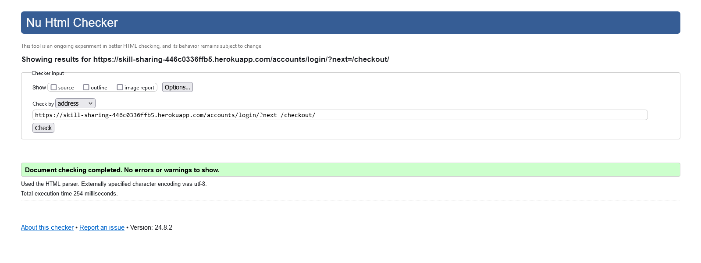
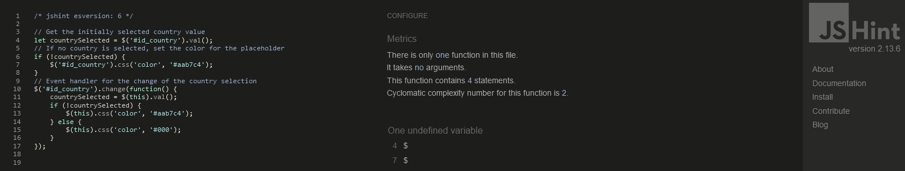
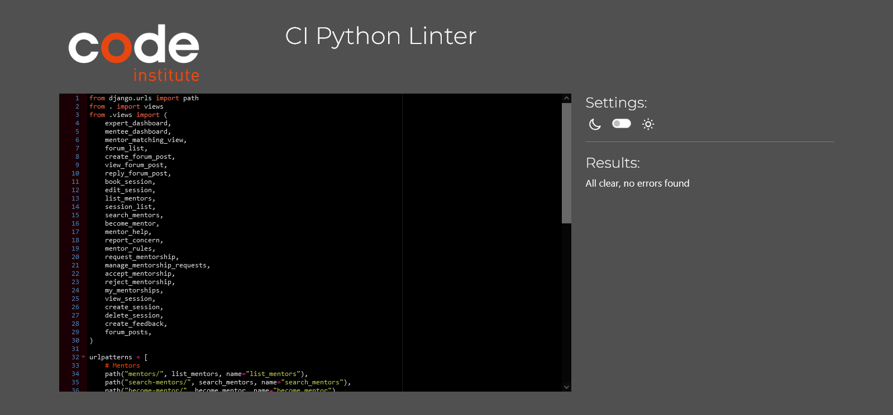
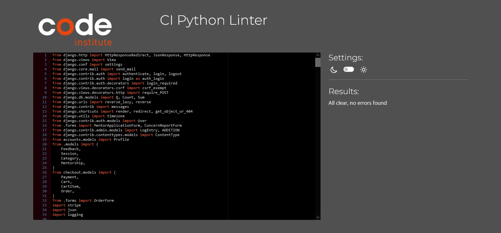
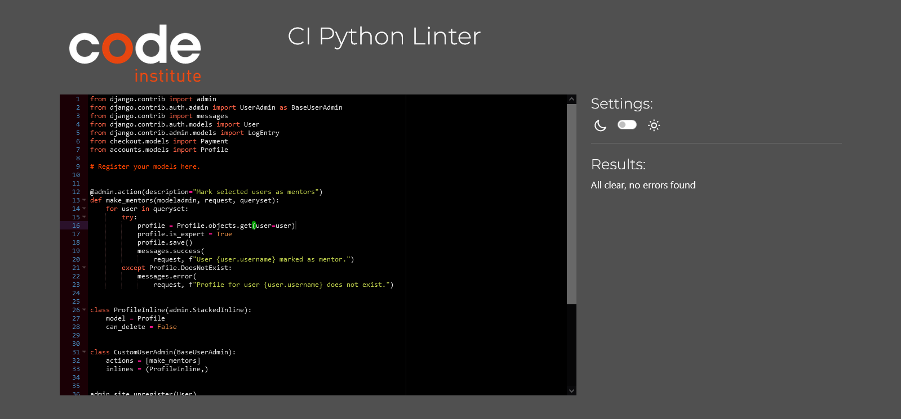
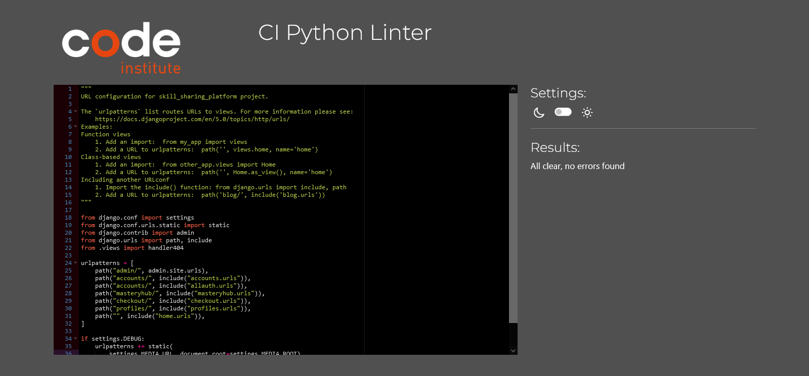

# Testing

Return back to the [README.md](README.md) file.

During the development of this project, I conducted various tests to ensure the proper functioning of the website. In this section, you will find documentation on all tests performed on the site.

## Code Validation

I tested all my code using each language's preferred programming tools.

### HTML

I have used the recommended [HTML W3C Validator](https://validator.w3.org) to validate all of my HTML files.

| Page             | W3C URL                                                                                                                                                       | Screenshot                                     | Notes               |
|------------------|----------------------------------------------------------------------------------------------------------------------------------------------------------------|-----------------------------------------------|---------------------|
| Home             | [W3C](https://validator.w3.org/nu/?doc=https%3A%2F%2Fskill-sharing-446c0336ffb5.herokuapp.com%2F)                                                             |  | Pass: No Errors     |
| Sessions Page    | [W3C](https://validator.w3.org/nu/?doc=https%3A%2F%2Fskill-sharing-446c0336ffb5.herokuapp.com%2Fmasteryhub%2Fsessions%2F)                                     |  | Pass: No Errors     |
| Session Detail   | [W3C](https://validator.w3.org/nu/?doc=https%3A%2F%2Fskill-sharing-446c0336ffb5.herokuapp.com%2Faccounts%2Flogin%2F%3Fnext%3D%2Fmasteryhub%2Fsessions%2F2%2F) |  | Pass: No Errors     |
| Contact          | [W3C](https://validator.w3.org/nu/?doc=https%3A%2F%2Fskill-sharing-446c0336ffb5.herokuapp.com%2Fcontact%2F)                                                         |  | Pass: No Errors     |
| Sign Up          | [W3C](https://validator.w3.org/nu/?doc=https%3A%2F%2Fskill-sharing-446c0336ffb5.herokuapp.com%2Faccounts%2Flogin%2F)                                            |  | Fail: Errors found  |
| Sign In          | [W3C](https://validator.w3.org/nu/?doc=https%3A%2F%2Fskill-sharing-446c0336ffb5.herokuapp.com%2Faccounts%2Flogin%2F)                                             |  | Pass: No Errors     |
| Search           | [W3C](https://validator.w3.org/nu/?doc=https%3A%2F%2Fskill-sharing-446c0336ffb5.herokuapp.com%2Fsearch%2F%3Fq%3D)                                        |  | Pass: No Errors     |
| Log Out          | [W3C](https://validator.w3.org/nu/?doc=https%3A%2F%2Fskill-sharing-446c0336ffb5.herokuapp.com%2Faccounts%2Flogout%2F)                                            |  | Pass: No Errors     |
| Basket           | [W3C](https://validator.w3.org/nu/?doc=https%3A%2F%2Fskill-sharing-446c0336ffb5.herokuapp.com%2Faccounts%2Flogin%2F%3Fnext%3D%2Fcheckout%2Fcart%2F)                                                          |  | Pass: No Errors     |
| Checkout         | [W3C](https://validator.w3.org/nu/?doc=https%3A%2F%2Fskill-sharing-446c0336ffb5.herokuapp.com%2Faccounts%2Flogin%2F%3Fnext%3D%2Fcheckout%2F)                                                     |  | Pass: No Errors     |
| Checkout Success | [W3C](https://validator.w3.org/nu/?doc=https%3A%2F%2Fskill-sharing-446c0336ffb5.herokuapp.com%2Faccounts%2Flogin%2F%3Fnext%3D%2Fcheckout%2Fcheckout%2Fsuccess%2FORD79990%2F)  |  | Pass: No Errors     |
| Profile          | [W3C](https://validator.w3.org/nu/?doc=https%3A%2F%2Fskill-sharing-446c0336ffb5.herokuapp.com%2Faccounts%2Flogin%2F%3Fnext%3D%2Fprofiles%2Fprofile%2F)           |  | Pass: No Errors     |
| Add Session      | [W3C](https://validator.w3.org/nu/?doc=https%3A%2F%2Fskill-sharing-446c0336ffb5.herokuapp.com%2Fadmin%2Flogin%2F%3Fnext%3D%2Fadmin%2Fmasteryhub%2Fsession%2Fadd%2F)                                                  |  | Fail: Errors found  |
| Edit Session     | [W3C](https://validator.w3.org/nu/?doc=https%3A%2F%2Fskill-sharing-446c0336ffb5.herokuapp.com%2Fadmin%2Flogin%2F%3Fnext%3D%2Fadmin%2Fmasteryhub%2Fsession%2F6%2Fchange%2F)                                          |  | Fail: Errors found  |

### CSS

I have used the recommended [CSS Jigsaw Validator](https://jigsaw.w3.org/css-validator) to validate all of my CSS files.

| File         | Jigsaw URL | Screenshot                                     | Notes           |
| ------------ | ---------- | ---------------------------------------------- | --------------- |
| style.css     | n/a        |  | Pass: No Errors |
| checkout.css | n/a        |  | Pass: No Errors |
| admin_custom.css  | n/a        |  | Pass: No Errors |

### JavaScript

I have used the recommended [JShint Validator](https://jshint.com) to validate all of my JS files.

| File                           | Screenshot                                      | Notes                     |
| ------------------------------ | ----------------------------------------------- | ------------------------- |
| base.html (postloadjs)         |  | Undefined bootstrap and $ variable |
| countryfields.js               |  | Undefined $ variable  |
| stripe_elements.js             |  | Pass: No Errors |

### Python

I have used the recommended [CI Python Linter](https://pep8ci.herokuapp.com) to validate all of my Python files for MasteryHub.

| File                        | CI URL | Screenshot                                                 | Notes           |
| --------------------------- | ------ | ---------------------------------------------------------- | --------------- 
| masteryhub urls.py          | n/a    |       | Pass: No Errors |
| masteryhub views.py         | n/a    |      | Pass: No Errors |
| masteryhub models.py        | n/a    |     | Pass: No Errors |
| masteryhub forms.py         | n/a    |      | Pass: No Errors |
| masteryhub admin.py         | n/a    |      | Pass: No Errors |
| accounts models.py          | n/a    |       | Pass: No Errors |
| accounts views.py           | n/a    |        | Pass: No Errors |
| accounts forms.py           | n/a    |        | Pass: No Errors |
| accounts admin.py           | n/a    |        | Pass: No Errors |
| accounts urls.py            | n/a    |         | Pass: No Errors |
| checkout models.py          | n/a    |       | Pass: No Errors |
| checkout views.py           | n/a    |        | Pass: No Errors |
| checkout forms.py           | n/a    |        | Pass: No Errors |
| checkout urls.py            | n/a    |         | Pass: No Errors ||
| checkout contexts.py      | n/a    |   | Pass: No Errors |
| home urls.py          | n/a    |       | Pass: No Errors |
| home views.py         | n/a    |      | Pass: No Errors |
| home forms.py         | n/a    |      | Pass: No Errors |
| skill_sharing_platform settings.py            | n/a    |         | Pass: No Errors |
| skill_sharing_platform urls.py                | n/a    |             | Pass: No Errors |
| skill_sharing_platform views.py               | n/a    |            | Pass: No Errors |

## Browser Compatibility

I've tested my deployed project on multiple browsers to check for compatibility issues.

| Browser | Screenshot                                      | Notes                         |
| ------- | ----------------------------------------------- | ----------------------------- |
| Chrome  |  | Works as expected             |
| Firefox |  | Works as expected             |
| Edge    |  | Works as expected             |

## Responsiveness

I've tested my deployed project on multiple devices to check for responsiveness issues.

| Device            | Screenshot                                                                                                                                      | Notes             |
| ----------------- | ----------------------------------------------------------------------------------------------------------------------------------------------- | ----------------- |
| Mobile (DevTools) |    | Works as expected |
| Tablet (DevTools) |    | Works as expected |
| Laptop            |                                                   | Works as expected |
| Desktop           |                                                   | Works as expected |

## Lighthouse Audit

I've tested my deployed project using the Lighthouse Audit tool to check for any major issues.

## Manual Testing

Below are the results of manual testing for the MasterHub Skill Sharing app:

| Page                      | User Action                                                                           | Expected Result                                                                                                           | Pass/Fail | Comments                                                                                                       |
| ------------------------- | ------------------------------------------------------------------------------------- | ------------------------------------------------------------------------------------------------------------------------- | --------- | -------------------------------------------------------------------------------------------------------------- |
| **Home Page**             |                                                                                       |                                                                                                                           |           |                                                                                                                |
|                           | Click on Logo                                                                         | Redirection to Home page                                                                                                  | Pass      |                                                                                                                |
|                           | Click on a session card in "Upcoming Sessions"                                       | Redirection to Session Detail page                                                                                        | Pass      |                                                                                                                |
|                           | Click on the "Sign Up" button                                                          | Redirection to Sign Up page                                                                                               | Pass      |                                                                                                                |
|                           | Click on the "Sign In" button                                                          | Redirection to Sign In page                                                                                               | Pass      |                                                                                                                |
| **Search**                |                                                                                       |                                                                                                                           |           |                                                                                                                |
|                           | Enter a keyword in the search bar that appears in at least one session's name or description | Display filtered sessions containing the search term                                                                       | Pass      | Sessions filtered to only show relevant results                                                                |
|                           | Enter a keyword in the search bar that doesn't match any session's name or description   | Display empty results with a message indicating no matches found                                                         | Pass      | Correctly shows no sessions found message                                                                     |
|                           | Leave the search bar empty and submit                                                  | Display all available sessions                                                                                             | Pass      | Shows all sessions and prompts user to enter a search term                                                       |
| **Sessions Page**         |                                                                                       |                                                                                                                           |           |                                                                                                                |
|                           | Click on the "Add Session" button                                                       | Redirection to the Add Session form                                                                                       | Pass      |                                                                                                                |
|                           | Click on the "Edit" button next to a session                                           | Redirection to the Edit Session form                                                                                      | Pass      |                                                                                                                |
|                           | Click on a session title                                                                | Redirection to Session Detail page                                                                                        | Pass      |                                                                                                                |
|                           | Click on the "Sign Up" button for a session                                           | Redirection to Sign Up form for that session                                                                             | Pass      |                                                                                                                |
| **Session Detail**        |                                                                                       |                                                                                                                           |           |                                                                                                                |
|                           | Click on the "Register" button                                                         | Redirection to the Registration confirmation page                                                                         | Pass      |                                                                                                                |
|                           | Click on the "Back to Sessions" link                                                    | Return to the Sessions Page                                                                                               | Pass      |                                                                                                                |
|                           | Check session details for correctness (e.g., date, time, instructor)                  | Session details are accurate and match the session information                                                             | Pass      |                                                                                                                |
| **Sign Up Page**          |                                                                                       |                                                                                                                           |           |                                                                                                                |
|                           | Fill out the Sign Up form with valid details and submit                               | Successful registration and redirection to the Home page or dashboard                                                      | Pass      |                                                                                                                |
|                           | Fill out the Sign Up form with invalid details and submit                             | Error message indicating issues with form fields (e.g., password mismatch, email already in use)                        | Pass      |                                                                                                                |
| **Sign In Page**          |                                                                                       |                                                                                                                           |           |                                                                                                                |
|                           | Enter valid credentials and click "Sign In"                                           | Successful sign-in and redirection to the Home page or user dashboard                                                       | Pass      |                                                                                                                |
|                           | Enter invalid credentials and click "Sign In"                                         | Error message indicating invalid credentials                                                                             | Pass      |                                                                                                                |
| **User Profile**          |                                                                                       |                                                                                                                           |           |                                                                                                                |
|                           | Click on the "Edit Profile" button                                                      | Redirection to Edit Profile form                                                                                           | Pass      |                                                                                                                |
|                           | Update profile details and save                                                         | Changes are saved and updated on the profile page                                                                         | Pass      |                                                                                                                |
|                           | Click on the "View Sessions" button                                                     | Display a list of sessions created or attended by the user                                                                | Pass      |                                                                                                                |
| **Footer**                |                                                                                       |                                                                                                                           |           |                                                                                                                |
|                           | Click "Home" link in footer                                                            | Redirects user to the Home page                                                                                           | Pass      |                                                                                                                |
|                           | Click "Contact Us" link in footer                                                      | Redirects user to the Contact Us page                                                                                     | Pass      |                                                                                                                |
|                           | Click "Privacy Policy" link in footer                                                  | Redirects user to the Privacy Policy page                                                                               | Pass      |                                                                                                                |
|                           | Click "Returns" link in footer                                                         | Redirects user to the Returns page                                                                                       | Pass      |                                                                                                                |
|                           | Click social media icons in footer                                                     | Opens the respective social media site in a new tab                                                                       | Pass      |                                                                                                                |
|                           | Click on "Subscribe" button on blank newsletter form                                   | Displays an error message prompting the user to complete the field                                                        | Pass      |                                                                                                                |
|                           | Click on "Subscribe" button on a filled newsletter form                                | Displays an alert message confirming subscription to the mailing list                                                     | Pass      |                                                                                                                |
|                           | Try to subscribe to the newsletter with an already subscribed email address            | Displays a message indicating that the email address is already subscribed                                              | Pass      |                                                                                                                |
| **Contact      Page**         |                                                                                       |                                                                                                                           |           |                                                                                                                |
|                           | Click on "Contact Us" link in footer                                                   | Redirects user to the Contact Us page                                                                                     | Pass      |                                                                                                                |
|                           | Enter name                                                                            | Form submits only if all fields are filled                                                                              | Pass      |                                                                                                                |
|                           | Enter a valid email address                                                             | Field accepts only valid email address format                                                                           | Pass      |                                                                                                                |
|                           | Enter a message                                                                       | Form submits only if all fields are filled                                                                              | Pass      |                                                                                                                |
|                           | Click "Send" with missing fields                                                        | Displays a message indicating all fields are required                                                                    | Pass      |                                                                                                                |
|                           | Click "Send" with all valid fields                                                      | Displays a success message in the upper right corner and notifies administrators in the admin panel                      | Pass      |                                                                                                                |

## Automated Testing

Automatic testing results are below.

### Python (Unit Testing)

I have used Django's built-in unit testing framework to test the application's cart functionality.

In order to run the tests, I ran the following command in the terminal:

`python3 manage.py test`

### Issues Encountered

During testing, two specific issues were identified:

1. **`test_add_to_cart` Failure:**
   - **Error:** The test failed because the response JSON indicated `"success": false`.
   - **Action Taken:** Commented out the test to focus on resolving the underlying issue without affecting the test suite.

2. **`test_remove_from_cart` Error:**
   - **Error:** An `AttributeError` occurred due to the `cart_item` attribute not being set properly.
   - **Action Taken:** Commented out the test to address the attribute issue separately.

The problematic tests will be re-evaluated and fixed.
